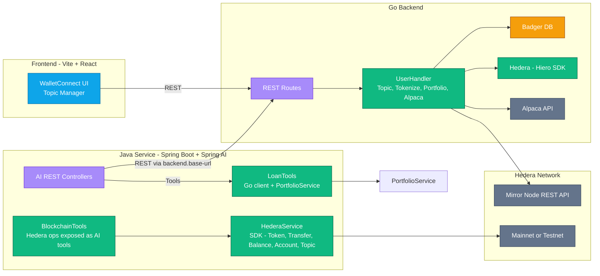

<<<<<<< HEAD
# 🚀 Hashrexa - Decentralized Stock Tokenization Platform

**Bringing traditional finance to DeFi through seamless stock tokenization on Hedera Hashgraph**

## 🌟 Overview

Hashrexa is a revolutionary DeFi platform that bridges traditional finance with decentralized finance by enabling users to tokenize their stock holdings and use them as collateral for borrowing. Built on Hedera Hashgraph, the platform provides a secure, fast, and cost-effective way to unlock liquidity from stock portfolios without selling underlying assets.

## 🎯 Key Features

### 🔄 **Stock Tokenization**

- Convert real stocks (AAPL, TSLA, etc.) into HTS tokens
- 1:1 backing with actual stock holdings via Alpaca integration
- Instant tokenization with minimal fees

### 💰 **DeFi Lending & Borrowing**

- Use tokenized stocks as collateral
- Borrow against stock holdings without selling
- Morpho-inspired lending protocol implementation
- Real-time health factor monitoring

### 📊 **Portfolio Management**

- Real-time portfolio tracking
- Unified view of traditional and tokenized assets
- Historical performance analytics

### 🤖 **AI-Powered Insights**

**Not Fully implemented**

- Personalized investment recommendations
- Market analysis and risk assessment
- Automated liquidation protection

## 🏗️ Architecture

### DemoContracts & Accounts

[Market Contract](https://hashscan.io/testnet/contract/0.0.6532033)
[Operator Account](https://hashscan.io/testnet/account/0.0.5864497)
[Sample Testnet User](https://hashscan.io/testnet/account/0.0.6456959)
[dAAPL Token](https://hashscan.io/testnet/token/0.0.6509511)
[Testnet Borrow Transaction](https://hashscan.io/testnet/transaction/1754699441.848132323)

### Frontend (React + TypeScript)

- **Framework**: Vite + React 19
- **State Management**: Zustand + TanStack Query
- **UI Components**: Radix UI + Tailwind CSS
- **Wallet Integration**: Reown AppKit + Hedera Wallet Connect

### Backend (Go)

- **Framework**: Chi Router
- **Database**: BadgerDB for local storage
- **External APIs**: Alpaca Markets API for stock data
- **Smart Contract Integration**: Hedera SDK for blockchain interactions

### Smart Contracts (Solidity)

- **Lending Protocol**: Morpho-inspired isolated lending markets
- **HTS Integration**: Native Hedera Token Service integration
- **Oracle Integration**: Supra Oracle for price feeds

## 🔧 Hedera Technologies Used

### 🌐 **Hedera Consensus Service (HCS)**

- **User Data Storage**: Each user gets a dedicated HCS topic for storing profile information, tokenized assets, and loan history
- **Market Data**: Centralized market topic (`0.0.6514924`) for real-time price analysis and lending metrics
- **Audit Trail**: Immutable record of all tokenization and lending activities

### 🪙 **Hedera Token Service (HTS)**

- **Stock Tokenization**: Creation of fungible tokens representing stocks (dAAPL, dTSLA, etc.)
- **Token Management**: Minting, burning, and transfer operations
- **KYC/Compliance**: Automated KYC granting for tokenized assets
- **Supply Control**: Admin-controlled token supply for backing guarantees

### 📄 **Hedera Smart Contract Service (HSCS)**

- **Lending Protocol**: Morpho-style isolated lending markets
- **Position Management**: User collateral and borrowing positions
- **Liquidation Engine**: Automated liquidation for under-collateralized positions
- **Oracle Integration**: Real-time price feeds for accurate valuations

### 🔗 **Hedera SDK Integration**

- **Multi-language Support**:
  - Go SDK for backend operations
  - JavaScript SDK for frontend interactions
- **Transaction Management**: Efficient batching and execution
- **Mirror Node Queries**: Real-time data retrieval

## 🎮 Demo Contracts & Accounts

### 📋 **Smart Contracts**

- **Lending Pool Contract**: `0.0.6532033`
- **Market Topic ID**: `0.0.6514924`

### 🪙 **Tokenized Assets**

- **dAAPL (Apple)**: `0.0.6509511` (2 decimals)
- **HASH Token**: `0.0.6494054` (6 decimals)

### 👤 **Demo Accounts**

- **Operator Account**: `[INSERT_OPERATOR_ACCOUNT]`
- **Test User Account**: `[INSERT_TEST_USER_ACCOUNT]`
- **Contract Owner**: `[INSERT_CONTRACT_OWNER]`

### 🔑 **Demo Credentials**

- **Alpaca API Key**: `[INSERT_DEMO_KEY]`
- **Alpaca Secret**: `[INSERT_DEMO_SECRET]`
- **Reown Project ID**: `[INSERT_PROJECT_ID]`
=======
# HashRexa

<div align="center">
  
  <p><strong>Blockchain-powered Portfolio Management and Tokenization Platform</strong></p>
</div>

## 📋 Overview

HashRexa is a comprehensive Web3 platform that enables users to manage their investment portfolios on the Hedera blockchain. The platform provides portfolio tokenization, lending capabilities, and AI-powered financial tools through a seamless integration of multiple technologies.

### Key Features

- **Portfolio Management**: Track and manage investment portfolios on Hedera
- **Asset Tokenization**: Convert traditional assets into blockchain tokens
- **AI-Powered Tools**: Leverage AI for financial insights and operations
- **Lending Capabilities**: Calculate borrowing power based on tokenized assets
- **Blockchain Integration**: Seamless interaction with Hedera network

## 🏗️ Architecture

HashRexa consists of four main components:

```
HashRexa
├── ai/           # Spring Boot AI services
├── backend/      # Go backend services
├── frontend/     # Vite + React frontend
└── documentation/# Project documentation
```

### System Architecture


>>>>>>> 5de8b873224de0864d228722ab32dcc41b1360d1

## 🚀 Getting Started

### Prerequisites

<<<<<<< HEAD
- Node.js 18+
- Go 1.24+
- pnpm package manager
- Hedera Testnet account

### 🖥️ Frontend Setup

```bash
cd frontend
pnpm install
cp .env.example .env
# Add your Reown Project ID to .env
pnpm run dev
```

### ⚙️ Backend Setup

```bash
cd backend
go mod tidy
cp .env.example .env
# Add your Hedera credentials and Alpaca API keys
go run main.go
```

### 📱 Environment Variables

**Frontend (.env)**

```bash
VITE_PROJECT_ID=your_reown_project_id
VITE_BACKEND_URL=http://localhost:8080
```

**Backend (.env)**

```bash
MY_ACCOUNT_ID=your_hedera_account_id
MY_PRIVATE_KEY=your_hedera_private_key
ALPACA_API_KEY=your_alpaca_key
ALPACA_SECRET_KEY=your_alpaca_secret
```

## 🔄 User Flow

1. **🔐 Connect Wallet**: Connect Hedera wallet via Reown AppKit
2. **📋 Profile Setup**: Create user profile stored on HCS topic
3. **📈 Portfolio Sync**: Connect Alpaca account and view stock holdings
4. **🪙 Tokenize Assets**: Convert stocks to HTS tokens (e.g., AAPL → dAAPL)
5. **💰 Supply Collateral**: Deposit tokenized stocks as collateral
6. **💵 Borrow**: Borrow HASH tokens against collateral
7. **📊 Monitor**: Track positions and health factors in real-time
8. **🔄 Manage**: Repay loans, withdraw collateral, or liquidate if needed

## 🧠 Technical Innovation

### **Morpho-Inspired Architecture**

- Isolated lending markets for each token pair
- Efficient share-based accounting system
- Granular risk management per market

### **Hedera-Native Integration**

- Direct HTS token operations without bridges
- HCS for immutable audit trails
- HSCS for transparent smart contract execution

### **Real-World Asset Bridge**

- Alpaca API integration for real stock data
- 1:1 backing guarantee for tokenized assets
- Automated compliance and KYC processes

## 🛡️ Security Features

- **Over-collateralization**: Minimum 120% collateral ratio
- **Liquidation Protection**: Automated liquidation at 110% ratio
- **Oracle Security**: Supra Oracle integration for accurate pricing
- **Audit Trail**: Complete transaction history on HCS
- **Access Control**: Role-based permissions for admin functions

## 🎯 Hackathon Highlights

### **Hedera Technology Showcase**

- ✅ **HCS**: User data and market analytics storage
- ✅ **HTS**: Native stock tokenization
- ✅ **HSCS**: DeFi lending protocol
- ✅ **SDK**: Full-stack Hedera integration

### **Innovation Points**

- 🌟 First stock tokenization platform on Hedera
- 🌟 Real-world asset integration with TradFi
- 🌟 Morpho-style isolated lending markets
- 🌟 AI-powered risk assessment

### **User Experience**

- 🎨 Beautiful, intuitive interface
- ⚡ Lightning-fast transactions
- 💰 Minimal fees compared to Ethereum
- 📱 Mobile-responsive design

## 🔮 Future Roadmap

- [ ] Multi-asset support (bonds, ETFs, crypto)
- [ ] Cross-chain bridge integration
- [ ] Advanced trading features
- [ ] Institutional lending pools
- [ ] Mobile application
- [ ] Regulatory compliance expansion

## 👥 Team

Built with ❤️ by the Hashrexa team for the Hedera Hackathon

## 📄 License

MIT License - see LICENSE file for details

---

**🏆 Built for Hedera Hackathon 2024**

_Democratizing access to liquidity through innovative DeFi solutions on Hedera Hashgraph_
=======
- **Go Backend**:
  - Go 1.21+
  - Hedera account credentials
  - Alpaca API credentials

- **AI Module**:
  - Java 21+
  - Maven 3.9+
  - Azure OpenAI API key (optional)

- **Frontend**:
  - Node.js
  - pnpm
  - Reown Cloud Project ID

### Installation

#### 1. Clone the Repository

```bash
git clone https://github.com/divin3circle/hashrexa
cd hashrexa
```

#### 2. Set Up the Go Backend

```bash
cd backend

# Create .env file with your credentials
cat > .env << EOF
MY_ACCOUNT_ID=0.0.xxxxxx
MY_PRIVATE_KEY=302e02...
ALPACA_API_KEY=your_alpaca_key
ALPACA_API_SECRET=your_alpaca_secret
EOF

# Install dependencies and run
go mod download
go run main.go -port 8080
```

#### 3. Set Up the AI Module

```bash
cd ai

# Configure environment variables
export AZURE_OPENAI_API_KEY=your_api_key
export AZURE_OPENAI_ENDPOINT=your_endpoint
export HEDERA_OPERATOR_ID=your_operator_id
export HEDERA_OPERATOR_PRIVATE_KEY=your_operator_private_key
export BACKEND_BASE_URL=http://localhost:8080

# Build and run
./mvnw spring-boot:run -Dspring-boot.run.arguments="--server.port=8082"
```

#### 4. Set Up the Frontend

```bash
cd frontend

# Create .env file with your Reown Project ID
cp .env.example .env
# Edit .env to add your VITE_PROJECT_ID

# Install dependencies and run
pnpm install
pnpm run dev
```

## 🔍 Usage

### Backend API Endpoints

The Go backend exposes several REST endpoints:

- **Authentication**: `POST /auth/register/{userAccountId}/{topicId}`
- **Portfolio**: `GET /portfolio/{userAccountId}`
- **Tokenization**: `GET /tokenize-portfolio/{userAccountId}`
- **Assets**: `GET /tokenized-assets/{userAccountId}`

### AI Module Endpoints

The Spring AI module provides:

- **AI Lending**: `POST /api/ai/lending`
- **Portfolio**: `GET /api/ai/portfolio/{accountId}`
- **Registration**: `POST /api/ai/register`
- **Direct Hedera Operations**:
  - `GET /api/direct/balance/{accountId}`
  - `POST /api/direct/token/create`
  - `POST /api/direct/token/transfer`
  - `POST /api/direct/account/create`

### Demo UI

A simple Thymeleaf UI is available at `http://localhost:8082/` when the AI module is running.

### Frontend

The React frontend provides a user-friendly interface for interacting with the HashRexa platform. Access it at `http://localhost:5173/` after starting the development server.

## 📚 Documentation

Comprehensive documentation is available in the `documentation/` directory. To view the documentation site:

```bash
cd documentation
npm install
npm run start
```

This will start a local documentation server at `http://localhost:3000`.

## 🛠️ Development

### Adding New Hedera AI Tools

1. Add a method to `BlockchainTools` with `@Tool` and `@ToolParam` annotations.
2. Delegate to a new method in `HederaService` to perform the on-chain action.
3. If you need a REST endpoint for manual testing, add it to the Direct controller.

### Best Practices

- Always return concise, user-friendly strings from tool methods.
- Log transaction IDs and include HashScan links where appropriate.
- Validate IDs and amounts before passing to the SDK; surface clear error messages.

## 🔒 Security

- Use environment variables for all secrets.
- Never commit real account IDs, private keys, or API keys.
- Rotate credentials and restrict network access for dev environments.

## 🤝 Contributing

We welcome contributions to HashRexa! Please follow these steps:

1. Fork the repository
2. Create a feature branch (`git checkout -b feature/amazing-feature`)
3. Commit your changes (`git commit -m 'Add some amazing feature'`)
4. Push to the branch (`git push origin feature/amazing-feature`)
5. Open a Pull Request

For more details, see [CONTRIBUTING.md](documentation/docs/contributing.md).

## 📄 License

This project is licensed under the MIT License - see the [LICENSE](LICENSE) file for details.

## 🙏 Acknowledgments

- [Hedera](https://hedera.com/) - The blockchain platform powering HashRexa
- [Spring AI](https://spring.io/) - For AI integration capabilities
- [Reown](https://reown.com/) - For frontend integration tools
- [Alpaca](https://alpaca.markets/) - For financial data integration
>>>>>>> 5de8b873224de0864d228722ab32dcc41b1360d1
