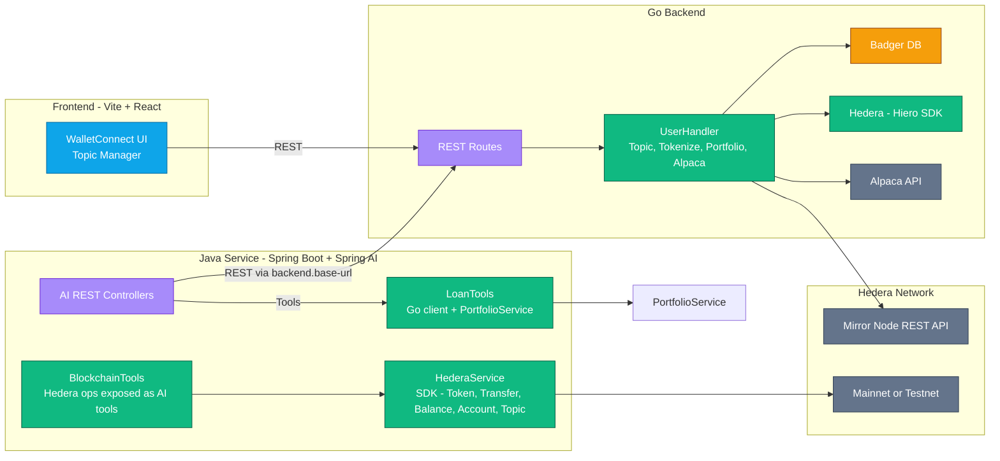

# HashRexa

<div align="center">
  
  <p><strong>Blockchain-powered Portfolio Management and Tokenization Platform</strong></p>
</div>

## 📋 Overview

HashRexa is a comprehensive Web3 platform that enables users to manage their investment portfolios on the Hedera blockchain. The platform provides portfolio tokenization, lending capabilities, and AI-powered financial tools through a seamless integration of multiple technologies.

### Key Features

- **Portfolio Management**: Track and manage investment portfolios on Hedera
- **Asset Tokenization**: Convert traditional assets into blockchain tokens
- **AI-Powered Tools**: Leverage AI for financial insights and operations
- **Lending Capabilities**: Calculate borrowing power based on tokenized assets
- **Blockchain Integration**: Seamless interaction with Hedera network

## 🏗️ Architecture

HashRexa consists of four main components:

```
HashRexa
├── ai/           # Spring Boot AI services
├── backend/      # Go backend services
├── frontend/     # Vite + React frontend
└── documentation/# Project documentation
```

### System Architecture



## 🚀 Getting Started

### Prerequisites

- **Go Backend**:

  - Go 1.21+
  - Hedera account credentials
  - Alpaca API credentials

- **AI Module**:

  - Java 21+
  - Maven 3.9+
  - Azure OpenAI API key (optional)

- **Frontend**:
  - Node.js
  - pnpm
  - Reown Cloud Project ID

### Installation

#### 1. Clone the Repository

```bash
git clone https://github.com/divin3circle/hashrexa
cd hashrexa
```

#### 2. Set Up the Go Backend

```bash
cd backend

# Create .env file with your credentials
cat > .env << EOF
MY_ACCOUNT_ID=0.0.xxxxxx
MY_PRIVATE_KEY=302e02...
ALPACA_API_KEY=your_alpaca_key
ALPACA_API_SECRET=your_alpaca_secret
EOF

# Install dependencies and run
go mod download
go run main.go -port 8080
```

#### 3. Set Up the AI Module

```bash
cd ai

# Configure environment variables
export AZURE_OPENAI_API_KEY=your_api_key
export AZURE_OPENAI_ENDPOINT=your_endpoint
export HEDERA_OPERATOR_ID=your_operator_id
export HEDERA_OPERATOR_PRIVATE_KEY=your_operator_private_key
export BACKEND_BASE_URL=http://localhost:8080

# Build and run
./mvnw spring-boot:run -Dspring-boot.run.arguments="--server.port=8082"
```

#### 4. Set Up the Frontend

```bash
cd frontend

# Create .env file with your Reown Project ID
cp .env.example .env
# Edit .env to add your VITE_PROJECT_ID

# Install dependencies and run
pnpm install
pnpm run dev
```

## 🔍 Usage

### Backend API Endpoints

The Go backend exposes several REST endpoints:

- **Authentication**: `POST /auth/register/{userAccountId}/{topicId}`
- **Portfolio**: `GET /portfolio/{userAccountId}`
- **Tokenization**: `GET /tokenize-portfolio/{userAccountId}`
- **Assets**: `GET /tokenized-assets/{userAccountId}`

### AI Module Endpoints

The Spring AI module provides:

- **AI Lending**: `POST /api/ai/lending`
- **Portfolio**: `GET /api/ai/portfolio/{accountId}`
- **Registration**: `POST /api/ai/register`
- **Direct Hedera Operations**:
  - `GET /api/direct/balance/{accountId}`
  - `POST /api/direct/token/create`
  - `POST /api/direct/token/transfer`
  - `POST /api/direct/account/create`

### Demo UI

A simple Thymeleaf UI is available at `http://localhost:8082/` when the AI module is running.

### Frontend

The React frontend provides a user-friendly interface for interacting with the HashRexa platform. Access it at `http://localhost:5173/` after starting the development server.

## 📚 Documentation

Comprehensive documentation is available in the `documentation/` directory. To view the documentation site:

```bash
cd documentation
npm install
npm run start
```

This will start a local documentation server at `http://localhost:3000`.

## 🛠️ Development

### Adding New Hedera AI Tools

1. Add a method to `BlockchainTools` with `@Tool` and `@ToolParam` annotations.
2. Delegate to a new method in `HederaService` to perform the on-chain action.
3. If you need a REST endpoint for manual testing, add it to the Direct controller.

### Best Practices

- Always return concise, user-friendly strings from tool methods.
- Log transaction IDs and include HashScan links where appropriate.
- Validate IDs and amounts before passing to the SDK; surface clear error messages.

## 🔒 Security

- Use environment variables for all secrets.
- Never commit real account IDs, private keys, or API keys.
- Rotate credentials and restrict network access for dev environments.

## 🤝 Contributing

We welcome contributions to HashRexa! Please follow these steps:

1. Fork the repository
2. Create a feature branch (`git checkout -b feature/amazing-feature`)
3. Commit your changes (`git commit -m 'Add some amazing feature'`)
4. Push to the branch (`git push origin feature/amazing-feature`)
5. Open a Pull Request

For more details, see [CONTRIBUTING.md](documentation/docs/contributing.md).

## 📄 License

This project is licensed under the MIT License - see the [LICENSE](LICENSE) file for details.

## 🙏 Acknowledgments

- [Hedera](https://hedera.com/) - The blockchain platform powering HashRexa
- [Spring AI](https://spring.io/) - For AI integration capabilities
- [Reown](https://reown.com/) - For frontend integration tools
- [Alpaca](https://alpaca.markets/) - For financial data integration
