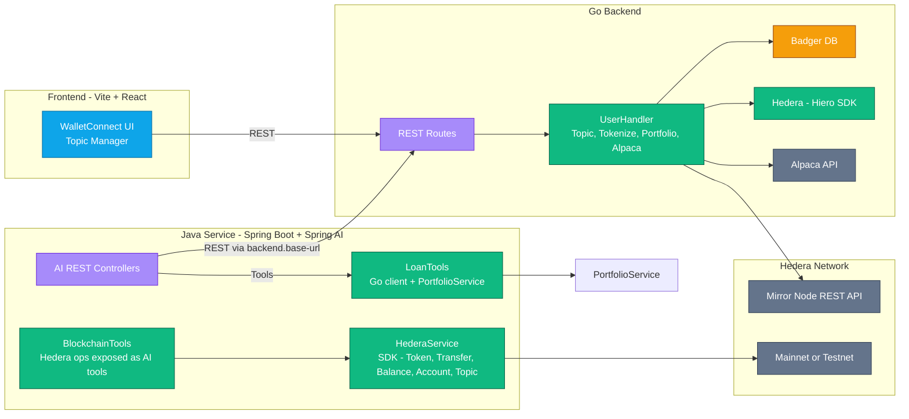
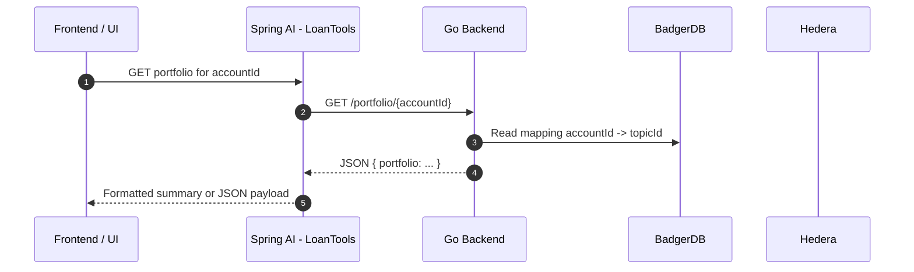

# HashRexa AI (Spring) — Go-backed AI Endpoints and Demo UI

This module contains Spring AI services that consume a Go backend for portfolio and tokenization data, expose AI tools for Hedera operations, and offer a simple Thymeleaf UI for manual testing.

## Prerequisites
- Java 21+
- Maven 3.9+
- Go backend running locally (defaults to `http://localhost:8080`)
- Hedera and Alpaca environments configured for the Go backend (see its README)

## Quick Start

### 1) Start the Go backend (port 8080)
```bash
# Requirements: Go 1.21+
cd backend
go mod download
go run main.go -port 8080
```

### 2) Start the Java AI app (port 8082)
```bash
cd ai
./mvnw spring-boot:run -Dspring-boot.run.arguments="--server.port=8082 --backend.base-url=http://localhost:8080"
```

The AI app will be available at:
- http://localhost:8082 (UI pages)
- http://localhost:8082/swagger-ui.html (if enabled)

## Configuration

You can use application.yml (preferred) with environment variables, or set properties via command-line.

```yaml
# application.yml
spring:
  application:
    name: spring-hedera
  ai:
    azure:
      openai:
        api-key: ${AZURE_OPENAI_API_KEY}
        endpoint: ${AZURE_OPENAI_ENDPOINT}
        chat:
          options:
            deployment-name: ${AZURE_OPENAI_DEPLOYMENT:gpt-4}
            temperature: 0.7
            max-tokens: 1000

hedera:
  network: ${HEDERA_NETWORK:testnet}
  operator:
    account-id: ${HEDERA_OPERATOR_ID}
    private-key: ${HEDERA_OPERATOR_PRIVATE_KEY}

server:
  port: 8082

backend:
  base-url: ${BACKEND_BASE_URL:http://localhost:8080}
```

Tip:
- Set secrets via environment variables: AZURE_OPENAI_API_KEY, AZURE_OPENAI_ENDPOINT, HEDERA_OPERATOR_ID, HEDERA_OPERATOR_PRIVATE_KEY.
- Do not commit secrets to source control.

---

## Architecture

### System diagram


### Request sequence — Portfolio


---

## Endpoints (AI module)
- REST:
    - POST `http://localhost:8082/api/ai/lending`
        - Body: `{ "message": "Show my portfolio for 0.0.x" }`
    - GET `http://localhost:8082/api/ai/portfolio/{accountId}`
    - POST `http://localhost:8082/api/ai/register`
        - Body: `{ "accountId": "0.0.x", "email": "user@example.com", "topicId": "0.0.y" }`

- Direct Hedera ops (simple testing):
    - GET `http://localhost:8082/api/direct/balance/{accountId}`
    - POST `http://localhost:8082/api/direct/token/create`
    - POST `http://localhost:8082/api/direct/token/transfer`
    - POST `http://localhost:8082/api/direct/account/create`

### Example requests

```bash
# Check balance
curl -s http://localhost:8082/api/direct/balance/0.0.12345 | jq

# Create token
curl -s -X POST http://localhost:8082/api/direct/token/create \
  -H "Content-Type: application/json" \
  -d '{"name":"MyToken","symbol":"MTK","initialSupply":1000000,"decimals":2}' | jq

# Transfer tokens
curl -s -X POST http://localhost:8082/api/direct/token/transfer \
  -H "Content-Type: application/json" \
  -d '{"tokenId":"0.0.555","toAccountId":"0.0.12345","amount":1000}' | jq

# Create account
curl -s -X POST http://localhost:8082/api/direct/account/create | jq
```

---

## Code Samples

### Hedera client configuration
```java
// HederaConfig.java
@Configuration
public class HederaConfig {
    @Value("${hedera.network}")
    private String network;

    @Value("${hedera.operator.account-id}")
    private String operatorAccountId;

    @Value("${hedera.operator.private-key}")
    private String operatorPrivateKey;

    @Bean
    public Client client() throws TimeoutException {
        Client client = "testnet".equals(network) ? Client.forTestnet() : Client.forMainnet();
        client.setOperator(AccountId.fromString(operatorAccountId), PrivateKey.fromString(operatorPrivateKey));
        return client;
    }
}
```

### Hedera operations service
```java
// HederaService.java (highlights)
@Service
public class HederaService {
    private final Client client;

    public HederaService(Client client) { this.client = client; }

    public BlockchainModels.OperationResult createToken(BlockchainModels.TokenCreateRequest request) {
        TokenCreateTransaction tx = new TokenCreateTransaction()
            .setTokenName(request.name())
            .setTokenSymbol(request.symbol())
            .setInitialSupply(request.initialSupply())
            .setDecimals(request.decimals() != null ? request.decimals() : 2)
            .setTreasuryAccountId(client.getOperatorAccountId())
            .setAdminKey(client.getOperatorPublicKey())
            .setSupplyKey(client.getOperatorPublicKey())
            .setFreezeDefault(false);

        TransactionResponse resp = tx.execute(client);
        TransactionReceipt receipt = resp.getReceipt(client);

        String tokenId = receipt.tokenId.toString();
        return BlockchainModels.OperationResult.success(
            String.format("Token '%s' created successfully with id: %s", request.name(), tokenId),
            resp.transactionId.toString()
        );
    }

    public BlockchainModels.OperationResult transferTokens(BlockchainModels.TransferRequest request) {
        TokenId tokenId = TokenId.fromString(request.tokenId());
        AccountId to = AccountId.fromString(request.toAccountId());
        AccountId from = client.getOperatorAccountId();

        TransferTransaction tx = new TransferTransaction()
            .addTokenTransfer(tokenId, from, -request.amount())
            .addTokenTransfer(tokenId, to, request.amount());

        TransactionResponse resp = tx.execute(client);
        return BlockchainModels.OperationResult.success(
            String.format("Successfully transferred %d tokens to %s", request.amount(), request.toAccountId()),
            resp.transactionId.toString()
        );
    }

    public BlockchainModels.OperationResult getAccountBalance(BlockchainModels.BalanceQuery request) {
        AccountId accountId = AccountId.fromString(request.accountId());
        AccountBalance balance = new AccountBalanceQuery().setAccountId(accountId).execute(client);
        return BlockchainModels.OperationResult.success(
            String.format("Account %s has %s HBAR", request.accountId(), balance.hbars),
            new BalanceInfo(balance.hbars.toString())
        );
    }
}
```

### Exposing Hedera ops as AI tools
```java
// BlockchainTools.java (highlights)
@Component
public class BlockchainTools {
    private final HederaService hederaService;

    public BlockchainTools(HederaService hederaService) { this.hederaService = hederaService; }

    @Tool(description = "Create a new token on Hedera network.")
    public String createToken(
        @ToolParam(description = "Token name") String name,
        @ToolParam(description = "Token symbol") String symbol,
        @ToolParam(description = "Initial supply") int initialSupply,
        @ToolParam(description = "Decimals", required = false) Integer decimals
    ) { /* delegates to hederaService.createToken(...) and returns a friendly string */ }

    @Tool(description = "Transfer tokens from the operator account to another account.")
    public String transferTokens(
        @ToolParam(description = "Token ID") String tokenId,
        @ToolParam(description = "Recipient account ID") String toAccountId,
        @ToolParam(description = "Amount") long amount
    ) { /* delegates to hederaService.transferTokens(...) */ }

    @Tool(description = "Check HBAR and token balance for any Hedera account")
    public String checkBalance(@ToolParam(description = "Account ID") String accountId) { /* ... */ }

    @Tool(description = "Create a new Hedera account with a small initial balance")
    public String createAccount() { /* ... */ }
}
```

### Wiring AI with tools (server-side)
```java
// UiController.java (simplified)
@PostMapping("/ui/chat-blockchain")
public String chatBlockchain(@RequestParam("message") String message, Model model) {
    String system = """
        You are a Hedera blockchain assistant. Use the available functions for all blockchain operations.
        When users ask about blockchain operations, call the appropriate function:
        1. checkBalance  2. createToken  3. transferTokens  4. createAccount
    """;
    String content = ChatClient.builder(chatModel)
        .defaultSystem(system)
        .build()
        .prompt()
        .user(message)
        .tools(blockchainTools)
        .call()
        .content();
    model.addAttribute("result", content);
    return "result";
}
```

---

## Using the AI endpoints from a frontend

### Basic fetch
```typescript
// portfolio-client.ts
export async function getPortfolio(accountId: string) {
  const res = await fetch(`http://localhost:8082/api/ai/portfolio/${encodeURIComponent(accountId)}`, {
    method: "GET",
  });
  if (!res.ok) throw new Error(`Failed to fetch portfolio: ${res.statusText}`);
  return res.text(); // server returns a formatted string summary
}
```

### React Query integration
```typescript
// usePortfolio.ts
import { useQuery } from "@tanstack/react-query";

export function usePortfolio(accountId: string) {
  return useQuery({
    queryKey: ["portfolio", accountId],
    queryFn: async () => {
      const res = await fetch(`http://localhost:8082/api/ai/portfolio/${encodeURIComponent(accountId)}`);
      if (!res.ok) throw new Error("Failed to fetch portfolio");
      return res.text();
    },
    enabled: !!accountId,
  });
}
```

### Trigger AI-powered lending from UI
```typescript
// ai-lending.ts
export async function askLending(message: string) {
  const res = await fetch("http://localhost:8082/api/ai/lending", {
    method: "POST",
    headers: { "Content-Type": "application/json" },
    body: JSON.stringify({ message }),
  });
  if (!res.ok) throw new Error(`AI call failed: ${res.statusText}`);
  return res.text();
}
```

---

## Developer Guide

### Add a new Hedera AI tool
1. Add a method to `BlockchainTools` with `@Tool` and `@ToolParam` annotations.
2. Delegate to a new method in `HederaService` to perform the on-chain action.
3. If you need a REST endpoint for manual testing, add it to the Direct controller.

```java
// Example: add "associateToken" tool
@Tool(description = "Associate a token to an account")
public String associateToken(
  @ToolParam(description = "Account ID") String accountId,
  @ToolParam(description = "Token ID") String tokenId
) {
  BlockchainModels.OperationResult result = hederaService.associateToken(accountId, tokenId);
  return result.success() ? "Association complete: " + result.message() : "❌ " + result.error();
}
```

### Best practices
- Always return concise, user-friendly strings from tool methods.
- Log tx IDs and include HashScan links where appropriate.
- Validate IDs and amounts before passing to the SDK; surface clear error messages.

---

## Demo UI (Thymeleaf)
A minimal UI is available at `http://localhost:8082/`.

Pages:
- `/` — forms for register, portfolio, borrowing power, and tokenize
- `/result.html` — displays results

How to test:
1. Start both services (Go backend, Java AI).
2. Open `http://localhost:8082/`.
3. Use the forms to drive the AI tools (the UI calls the same tool layer used by the AI).

---

## Troubleshooting

- Mermaid diagram parsing errors:
    - Avoid parentheses in node labels; use `<br/>` for new lines.
    - Wrap complex labels in quotes and avoid special characters in edge text.
- Hedera errors:
    - Ensure operator account and private key are set via environment variables.
    - Verify network selection matches the operator account network.
- AI tool not being called:
    - Confirm the tool is included via `.tools(blockchainTools)` in the ChatClient call.
    - Check controller logs for exceptions from the tool delegate.

---

## Security
- Use environment variables for all secrets.
- Never commit real account IDs, private keys, or API keys.
- Rotate credentials and restrict network access for dev environments.

```