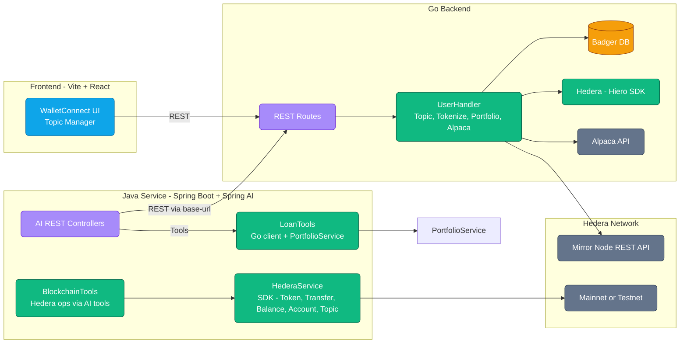
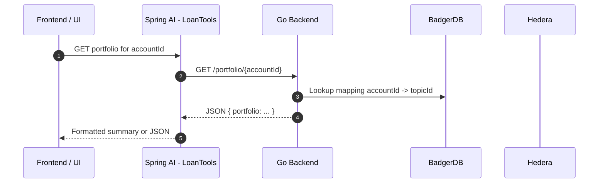

## System diagram



## Request sequence — portfolio



## Main components

- Hedera SDK and Mirror Node
  - HederaService executes on-chain ops: create token, transfer, balance, account, topic.
  - Go backend writes user state to HCS topics and reads via Mirror Node REST.

- Spring Boot backend services
  - REST controllers for AI interactions and direct testing.
  - Configuration for Hedera network and Go backend base URL.

- Spring AI module
  - Uses Azure OpenAI via Spring AI.
  - Tools:
    - BlockchainTools: exposes Hedera ops to the model.
    - LoanTools: Go backend integration + PortfolioService.

- Go backend (REST)
  - Endpoints for registration, tokenization, portfolio, positions, history.
  - Persists mappings in Badger; mints with Hiero SDK; fetches portfolio from Alpaca.

- Streaming
  - Stream AI or long-running results via SSE or WebSocket if needed (see Streaming).
```