# 🌟 HashRexa: AI-Powered Hedera Blockchain Platform

> **Transform traditional finance with AI-driven blockchain operations on Hedera**

## 🚀 What is HashRexa?

HashRexa is a **production-ready platform** that combines the power of **Hedera blockchain** with **AI intelligence** to create seamless financial applications. Think of it as your complete toolkit for building the next generation of decentralized finance (DeFi) applications.

### 🎯 The Problem We Solve

**Traditional blockchain development is complex:**
- ❌ Steep learning curve for blockchain integration
- ❌ Complex wallet connections and transaction management
- ❌ No intelligent assistance for financial operations
- ❌ Fragmented tools and inconsistent APIs

**HashRexa makes it simple:**
- ✅ **5-minute setup** with pre-configured services
- ✅ **AI-powered chat interface** for blockchain operations
- ✅ **Complete portfolio management** with real-time data
- ✅ **Production-ready APIs** with comprehensive documentation

## 🏗️ Architecture at a Glance

```mermaid
graph TB
    A[🎨 React Frontend] --> B[🤖 AI Service Java/Spring]
    A --> C[⚡ Go Backend]
    B --> D[🌐 Hedera Network]
    C --> D
    C --> E[📊 Alpaca Markets]
    B --> F[🧠 Azure OpenAI]
    
    style A fill:#61dafb
    style B fill:#6db33f
    style C fill:#00add8
    style D fill:#000000,color:#ffffff
    style E fill:#ffcc02
    style F fill:#0078d4,color:#ffffff
```

## 🎯 Who This Is For

| Developer Type | Use Case | Benefits |
|----------------|----------|----------|
| **Backend Engineers** | Building financial APIs | Pre-built Hedera integration, AI tools |
| **Frontend Developers** | Creating DeFi UIs | Ready-to-use components, wallet integration |
| **Blockchain Engineers** | Hedera development | Complete SDK examples, best practices |
| **AI Developers** | Blockchain + AI apps | Function calling, streaming responses |

## 🌟 Key Features

### 🤖 **AI-Powered Operations**
- Natural language blockchain interactions
- Intelligent portfolio analysis
- Real-time lending calculations
- Automated risk assessment

### 🔗 **Complete Hedera Integration**
- Token creation and management
- Account operations
- HCS (Hedera Consensus Service) topics
- Mirror Node data access

### 📊 **Portfolio Management**
- Real-time asset tracking
- Tokenization of traditional assets
- Integration with Alpaca Markets
- Historical performance analysis

### 🚀 **Developer Experience**
- RESTful APIs with OpenAPI docs
- Real-time streaming with SSE
- Comprehensive error handling
- Production-ready deployment configs

## 🏆 What You'll Build

After following our guides, you'll have:

1. **🎯 A complete DeFi application** with AI chat interface
2. **📱 Wallet-connected frontend** with React components
3. **🔧 Scalable backend services** in Go and Java
4. **🌐 Production deployment** on your preferred platform

## 🚀 Ready to Start?

  <a href="/quick-start" style="background: #6366f1; color: white; padding: 0.75rem 1.5rem; border-radius: 0.5rem; text-decoration: none; font-weight: bold;">🚀 Quick Start (5 min)</a>
  <a href="/getting-started" style="background: #10b981; color: white; padding: 0.75rem 1.5rem; border-radius: 0.5rem; text-decoration: none; font-weight: bold;">📚 Full Guide</a>
  <a href="/examples" style="background: #f59e0b; color: white; padding: 0.75rem 1.5rem; border-radius: 0.5rem; text-decoration: none; font-weight: bold;">💡 Examples</a>

---

## 🛠️ Technology Stack

| Component | Technology | Purpose |
|-----------|------------|---------|
| **Frontend** | React + Vite + TypeScript | Modern, fast UI development |
| **AI Service** | Spring Boot + Spring AI | AI-powered blockchain operations |
| **Backend** | Go + Gin | High-performance API services |
| **Blockchain** | Hedera SDK + Mirror Node | Decentralized ledger operations |
| **AI** | Azure OpenAI | Natural language processing |
| **Markets** | Alpaca API | Real-time financial data |

## 🌍 Community & Support

- 📖 **[Complete Documentation](/)** - Everything you need to know
- 🐛 **[Issue Tracker](https://github.com/your-org/hashrexa/issues)** - Report bugs or request features  
- 💬 **[Discussions](https://github.com/your-org/hashrexa/discussions)** - Community support
- 🚀 **[Contributing Guide](contributing)** - Help improve HashRexa

